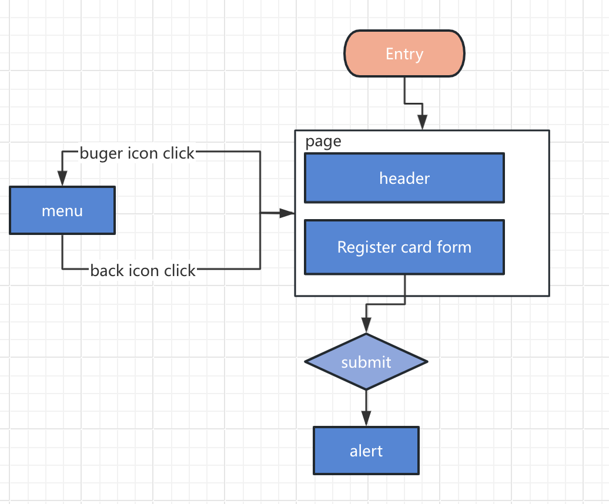

## development plan

## [TOC]

### **Revised Development Plan with Process Map Placement**

---

### Planning and Initial Setup

- **Objective**: Review the project requirements, set up the development environment, and create the roadmap for the application based on the provided process flow.

- **Tasks**:

  - [x] Review requirements
  - [x] Install dependencies.
  - [x] Provide development plan.
  - [x] Organize the folder structure:
    - `src/components`: For React components.
    - `src/__tests__`: For unit tests.

- **Process Map**:
  

### Component Development

#### Entry and Header with Menu Toggle

- **Objective**: Create a Header and implement an icon that toggles between the form and the menu.

- **Tasks**:

  - [ ] Write the test for the Header component
  - [ ] Write tests to ensure that clicking the burger icon shows the menu.
  - [ ] Write tests to ensure that clicking the back icon hides the menu.
  - [ ] Adjust the `app.tsx` structure.
  - [ ] Implement a Header component
  - [ ] Implement the menu state using React Context to manage visibility.
  - [ ] Implement the `MenuToggle` component that toggles visibility between shows and hides the `Menu`.
  - [ ] Implement responsive styling for the header and menu toggle.
  - [ ] Ensure keyboard navigation is possible and the MenuToggle is accessible (add aria-expanded, aria-controls attributes)
  - [ ] Test keyboard focus management (ensure the menu items are accessible via tabbing).
#### Menu

- **Objective**: Create a `Menu` component to show the menu content.

- **Tasks**:

  - [ ] Write tests to ensure that clicking the burger icon shows the menu.
  - [ ] Implement the `Menu` component that show the menu content`.
  - [ ] Add accessibility attributes.
  - [ ] Implement keyboard navigation for menu items .
  - [ ] Ensure the menu is accessible on screen readers.
  - [ ] Ensure the menu is responsive and adjust the layout for different screen sizes using SCSS.

#### Registration Card Form

- **Objective**: Create the initial registration form where users enter their credit card details.

- **Tasks**:

  - [ ] Write unit tests for the form rendering, input validation, and submission.
  - [ ] Implement the form fields (credit card number, CVC, expiry date) and "Submit" button.the form submission logic to trigger an alert upon success.
  - [ ] Add basic form validation (required fields, correct formats).
  - [ ] Implement the style and ensure the layout is responsive
  - [ ] Ensure the form is accessible.
  - [ ] Implement validation error messages to be announced by screen readers
  - [ ] Ensure keyboard accessibility for form navigation and submission.

### Styling and Responsiveness
- **Objective**: ensure Styling and Responsiveness in each components development.
- **Tasks**:
  - [x] Set up the common global responsive style
  - [ ] Apply styles using SCSS.
  - [ ] Ensure the application is responsive for different screen sizes.

### Accessibility

- **Objective**: Add accessibility features in each components development to ensure the app is usable by all users.

- **Tasks**:
  - [ ] Ensure all interactive elements are focusable and keyboard accessible.
  - [ ] Add appropriate ARIA attributes for screen reader users.
  - [ ] Use aria-live regions to announce dynamic content.
  - [ ] Test the entire application for keyboard navigation.
  - [ ] Run accessibility audits using Lighthouse to identify any missing accessibility features

### Testing and Final Adjustments
- **Objective**: Run automated tests to ensure all features are functional and accessible.
- **Tasks**:
  - [ ] Run unit tests to ensure all components meet functional requirements.
  - [ ] Run accessibility testing using Lighthouse to identify and fix any issues
  - [ ] Manually test the app for responsiveness, accessibility, and general usability.

